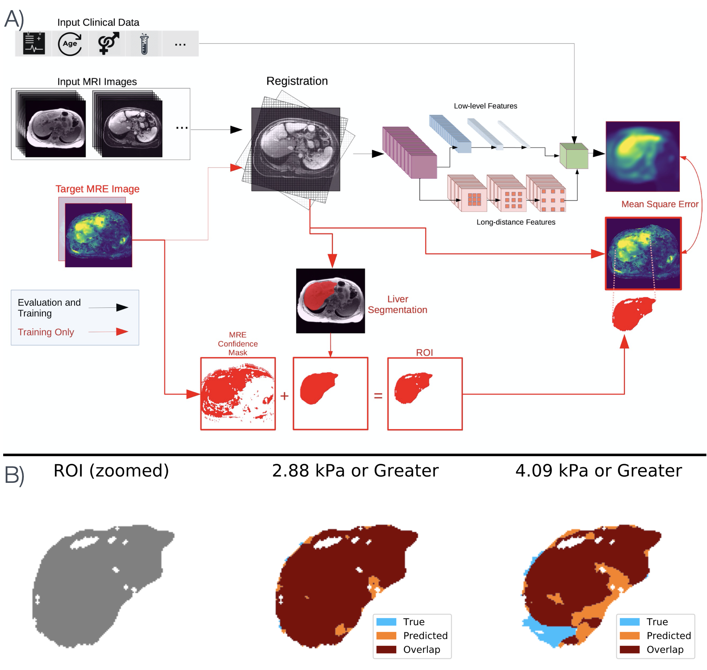
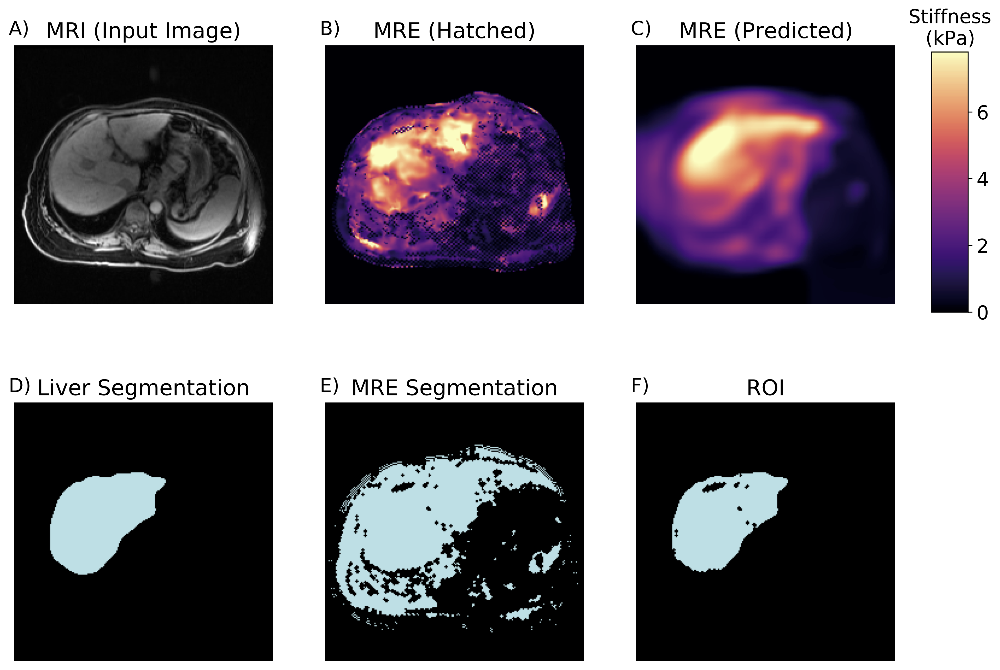

# Deep Learning Prediction of Voxel-Level Liver Stiffness in Patients with Nonalcoholic Fatty Liver Disease 
Companion software for
https://pubs.rsna.org/doi/abs/10.1148/ryai.2021200274



## Overview
**NOTE: The images used for training and evaluation are private data and NOT included in this repo.**

This repo contains notebooks and python modules used to train and evaluate the MRE AI architecture.  All input images are assumed to be properly oriented and converted into NIFTI format.  This repo covers registration, segmentation, data container generation, model training and evaluation.

## Installation

All required packages can be installed using the `environment.yml` file:

```
conda env create -f environment.yml
```

Registration is handled via [SimpleElastix](https://simpleelastix.github.io/), which is an extension of [SimpleITK](https://simpleitk.org/). It can be built via the instructions found here: https://simpleelastix.readthedocs.io/GettingStarted.html.  Please do not install any other versions of SimpleITK, as this can conflict with SimpleElastix.

It is recommended that the `mre_ai` modules be installed via `pip`:

```
pip install -e .
```

## Modules and Classes
All relevant python modules are found in the `mre_ai/` directory.  Segmentation is handled by `train_seg_model.py` and either `pytorch_arch_deeplab_3d.py`, as was done in the paper, or `pytorch_arch_models_genesis.py` ([ModelsGenesis github](https://github.com/MrGiovanni/ModelsGenesis) which can show improved results and generalization.  MRE generation is handled by `train_mre_model.py` and `pytorch_arch_deeplab_3d.py`.  



## Notebooks
Please refer to notebooks for information on how registration, segmentation, training, and evaluation are conducted.

